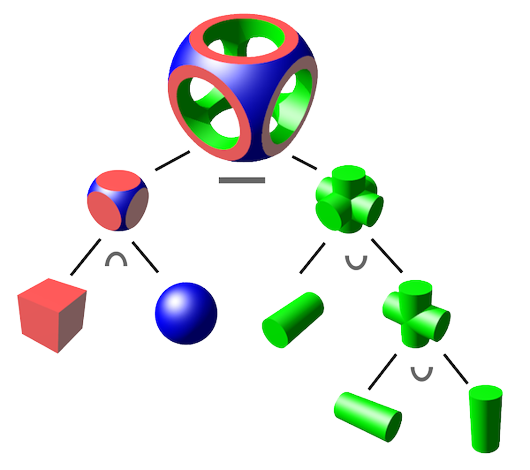
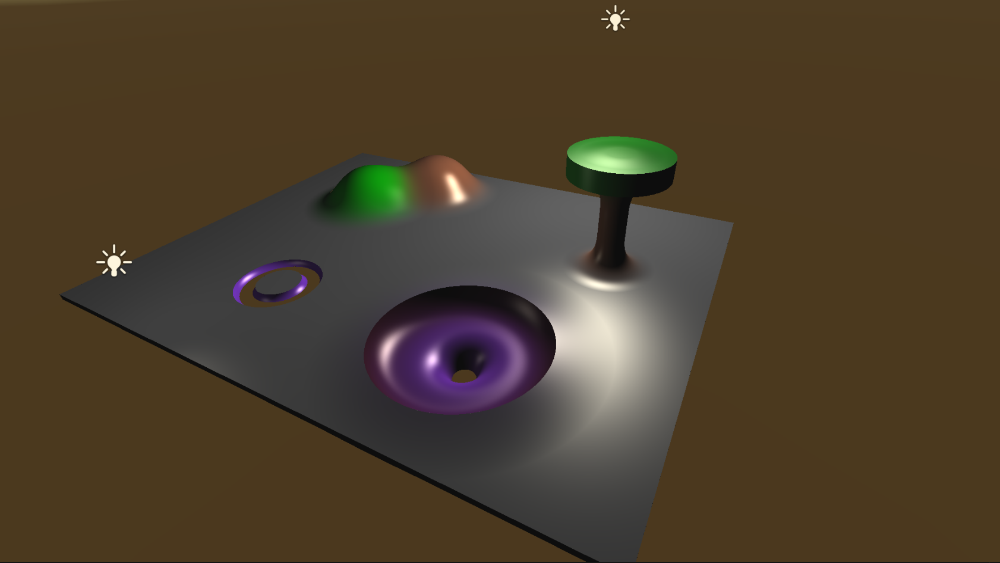

# Raymarching
 
 This was an experimental project to learn more about raymarching and unity's compute shader<br>
 therefore the code isn't my cleanest nor properly optimized, and is more a project made for the fun of it.<br>
 and you'll also see some code from me first testing out unity's compute shader. 
 
- [About raymarching](#About-raymarching)<br>
- [Sphere tracing snippet](#Sphere-Tracing-Snipped)<br>
- [Shading and normals](#Shading-and-normals)<br>
- [Constructive solid geometry](#Shape-operations)<br>
- [My result](#Result)<br>
- [Sources](#Sources)<br>
 
 <details open><summary><i> <h2>How to open</h2> </i> (Click to open/close)</summary>
	
---
	
<br>

To run this project you can simply open the assests folder it in the unity engine.<br>
<br>
Note: when opening the project you might get a notification saying there are error's in the project<br>
these errors are simply becouse of some project settings and is fairly easy to fix.<br><br>
<br><br>
In unity to get the size of struct using "sizeof" you have to mark the code as unsafe like so:<br>
```cpp
struct ShapeData
{
    public static unsafe int GetSize()
    {
        return sizeof(ShapeData);
    }
}
```
and that exact piece of code is whats causing the error when opening the file for the fist time.<br>
You can easly fix this by allowing unsafe code for that project like so:<br><br>
<br>
After that all errors will be gone and<br>
I ensure you none of the code is actually "unsafe" ;)<br>
 		
---
	
 </details>

## About raymarching


When I started this project I was happly suprised to find out it had a lot of simmeliarities to raytracing, and having made a raytracer in the past made this project go a lot easier.

Just as in raytracing, we have a position for the camera, put a grid in front of it, send rays from that camera position through each point in the grid, with each grid point corresponding to a pixel in the output image.

Now the big difference with raytracing is how we're finding the intersection between the view ray and the scene.

With raytracing we usually have some primitive geometies (like triangle's, spheres, and quats) and do a series of intersection tests seeign when and where the ray intersects with the geometry, if at all.

In raymarching, we use signed distance functions to find intersections between the ray and geometry, just like in raytracing we do this for every pixel but here instead of simply getting a boolian that says that you intersected with the geometry you get a value with the distance from the shape and by inreacing the size of the ray you will get closer and closer to the geometry until the value gets really small and thus you have hit the geometry.

For increasing the size of this ray you could simply increment it by small steps until the distance gets really small, but luckly some clever people have come up with a better and way more optimized way of doing this; called “sphere tracing”. 
Instead of incrementing by a tiny step every time, we take the maximum step we know is safe without going through the surface; in other words we step by the distance to the surface, which the SDF provides us! (see picture below)

<br>
Interestingly [GPU Gems 2](https://developer.nvidia.com/gpugems/gpugems2/part-i-geometric-complexity/chapter-8-pixel-displacement-mapping-distance-functions#:~:text=8.3%20The%20Distance%2DMapping%20Algorithm) shows how this can be used in distance mapping and also compaires it to raytracing

<div id="Sphere-Tracing-Snipped";>
 
Wich in my code looks something like this: (slightly simplyfied (removed code for the color of the pixel but you can find all code [here](Assets/Scripts/RayMarching/RayMarchingCS.compute)))
```HLSL
//returns the shortest distance from the eyepoint that the ray has to travel
//to get really close to the object, but if nothing had been found within the view range we just return max
float ClosestPointToSurface(float3 eye, float3 marchingDirection)
{
    float depth = MinDst;
    for (int i = 0; i < MaxMarchingSteps; i++)
    {
        float result = SceneSDF(eye + depth * marchingDirection);
        if (result <= Epsilon)
        {
            return depth;
        }
        depth += result;
        if (depth >= MaxDst)
        {
            return MaxDst;
        }
    }
    return MaxDst;
}
```
 
 </div>
 
### Shading and normals

Raymarching also has an interesting way of finding surface normals using signed distance functions,
for finding the nomals something called the [gradient](https://en.wikipedia.org/wiki/Gradient) is used, in simple terms this is a function that tells you at a given point in what direction to move to most rapidly increase the distance from the geometry.
Using signed distance functions, this gives us a pretty good estimation of our surface normal.

Which again in my code looks like this:
```HLSL
float3 EstimateNormal(float3 p)
{
	return normalize(float3(
        SceneSDF(float3(p.x + Epsilon, p.y, p.z)).w - SceneSDF(float3(p.x - Epsilon, p.y, p.z)),
        SceneSDF(float3(p.x, p.y + Epsilon, p.z)).w - SceneSDF(float3(p.x, p.y - Epsilon, p.z)),
        SceneSDF(float3(p.x, p.y, p.z + Epsilon)).w - SceneSDF(float3(p.x, p.y, p.z - Epsilon))
    ));
}
```
### Shape operations

Shape operations as I call them or Constructive solid geometry as a more technical term, is a way of creating complex geometry using boolian operations on wimple shapes simple shapes.

I think this image from wikipedia is a nice visual explenation of this.



And this is actually really simple to acheave using ray marching

```HLSL
    // None
    if (operation == 0)
    {
        if (dstB < dstA)
        {
            dst = dstB;
            colour = colourB;
        }
    }
    // Blend
    else if (operation == 1)
    {
        float4 blend = Blend(dstA, dstB, colourA, colourB, blendStrength);
        dst = blend.w;
        colour = blend.xyz;
    }
    // Cut
    else if (operation == 2)
    {
        // max(a,-b)
        if (-dstB > dst)
        {
            dst = -dstB;
            colour = colourB;
        }
    }
    // Mask
    else if (operation == 3)
    {
        // max(a,b)
        if (dstB > dst)
        {
            dst = dstB;
            colour = colourB;
        }
    }
```

Only the blend has a bit more complex code to both create a nice blend and have a smooth transition between colors
here's my code snippet but for more information on how it actually works i reccomend [this](https://www.iquilezles.org/www/articles/smin/smin.htm) site that gives a very nice explenation of this.

```HLSL
float4 Blend(float a, float b, float3 colA, float3 colB, float k)
{
    //see mix factor https://www.iquilezles.org/www/articles/smin/smin.htm
    const float h = max(k - abs(a - b), 0.0) / k;
    const float m = h * h * 0.5;
    const float s = m * k * (1.0 / 2.0);
    float2 result = (a < b) ? float2(a - s, m) : float2(b - s, 1.0 - m);

    float blendDst = result.x;
    float3 blendCol = lerp(colA, colB, result.y);

    return float4(blendCol, blendDst);
}
```

## Result




<br>

***Sources***
---
	
<br>
	
https://jamie-wong.com/2016/07/15/ray-marching-signed-distance-functions/#the-raymarching-algorithm<br>
https://www.iquilezles.org/www/articles/smin/smin.htm<br>
https://en.wikipedia.org/wiki/Gradient<br>
https://en.wikipedia.org/wiki/Constructive_solid_geometry<br>
http://iquilezles.org/www/articles/distfunctions/distfunctions.htm<br>
https://developer.nvidia.com/gpugems/gpugems2/part-i-geometric-complexity/chapter-8-pixel-displacement-mapping-distance-functions<br>
https://www.youtube.com/watch?v=BrZ4pWwkpto<br>

<br>
	
[Back to top](#readme)
